# tabular_Q-learning_Sarsa
this repository contains a tabular solved Q-learning and Sarsa implemented in Python.
## Tabular Q-learning and Sarsa
Q-leanring and Sarsa, being the most basic value based, model free algorithms, is solved  by tabular method and adopts a temporal difference update of Bellman equation. The difference between the two(on policy and off policy) is whether to use the optimal next state or the smapled next state to approximate the value of current state

The first formula is update equation for Sarsa and the second, Q-learning. Note that at decision making stage, both uses $\epsilon$-greedy to balance between exploration and exploitation

## Implementation

- agent.py : contains the Q-learning and Sarsa agent that interacts with environments and the table based Q-learning and Sarsa algorithm
- train.py : entrance of the program, including training and evaluating functions
- gridworld.py : provided by paddle, a visualization of the environments

## Training 
modify train.py to select environments to train on and starts training

    python train.py

To view matric(loss), use tensorboard in cmd

    tensorboard --logdir=runs

## Testing
### Environments
All the three and more environments are imported from DeepMind gym libaray

    import gym
    env = gym.make(env_name)
- FrozenLake-v0(not slippery)
An env with holes that and a start and end place. Agent should find the shortest path from start to end without falling into holes, otherwise will start over. Every step receives a -1 reward.

- FrozenLake-v0 slippery
Slippery version of FrozenLake-v0, meaning that at each state, the agent will be randomly shifted to other blocks

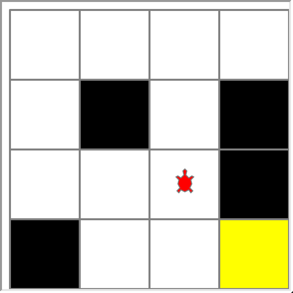

- CliffWalking-v0
An env with cliff, a start and end. Agent should find a shortest path from start to end without falling off. Everytime an agent falls off, it recieves -100 reward and gets itself back to start. Every step the agent recieves a -1 reward. 

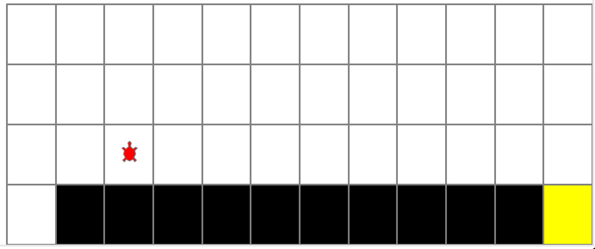

### Results
Both Sarsa and Q-learning agents are trained on 1000 episodes without any hyper parameter tuning(FrozenLake slippery uses 2000 episodes to train because a changing environment is hard to converge)
#### Q-learning on cliffwalking-v0

    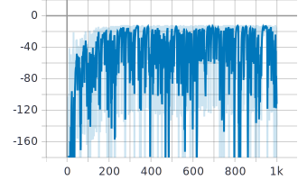
     
    
reward with respect to episode(train)

    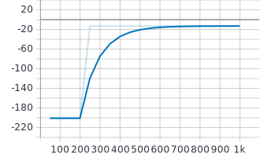
     
    
reward with respect to episode(val)

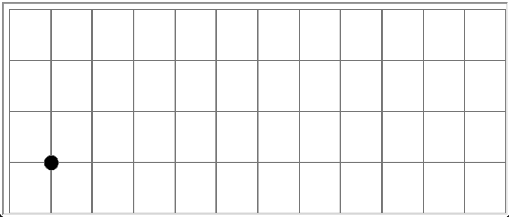
#### Sarsa on cliffwalking-v0

    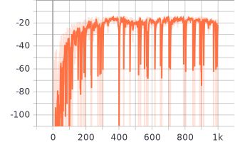
     
    
reward with respect to episode(train)

    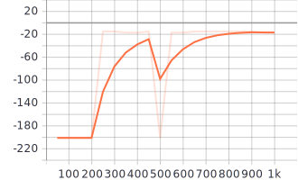
     
    
reward with respect to episode(val)

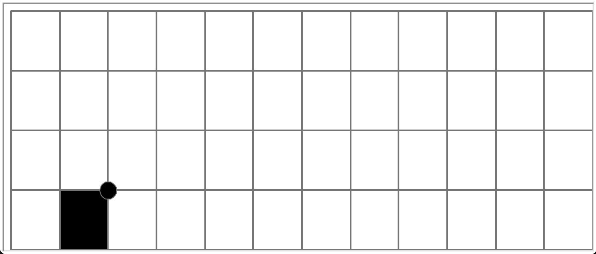

From the Q-learning and Sarsa demo on cliffwalking, we can see the difference. Sarsa updates from sample while Q-learning updates from bast giving rise to a much bolder agents than Sarsa
#### Q-learning on FrozenLake-v0

    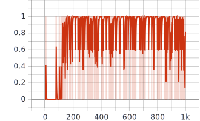
     
    
reward with respect to episode(train)

    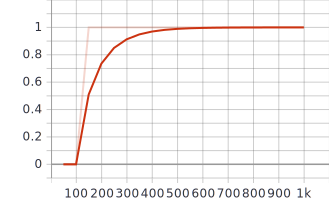
     
    
reward with respect to episode(val)

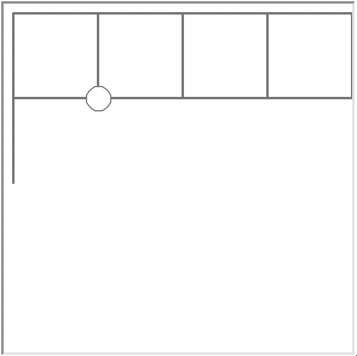

#### Q-learning on FrozenLake-v0-slippery

    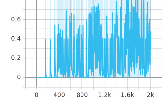
     
    
reward with respect to episode(train)

    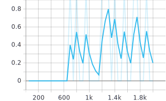
     
    
reward with respect to episode(val)

From the graph, we can see that the environment is constantly shifting the agent to other places
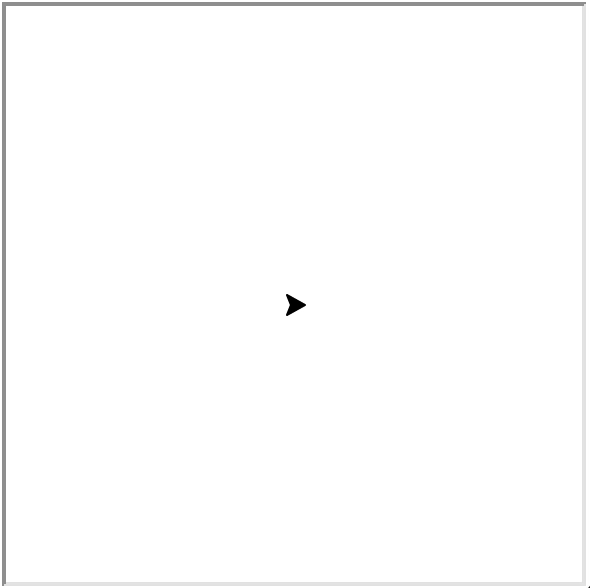

